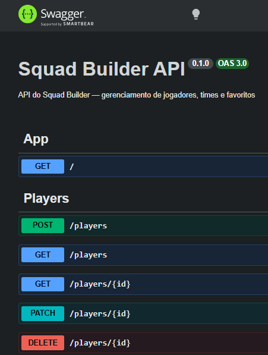
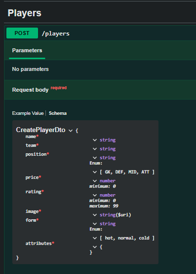
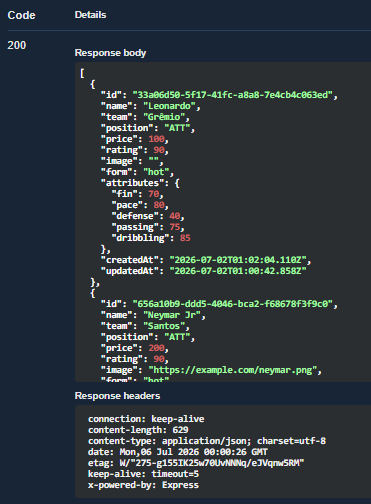

# Squad Builder — Backend

API REST do **Squad Builder**, um app de montar times de futebol. Este repositório é o backend
(em construção) que serve os dados para o app mobile em React Native.




## Sobre o projeto

O Squad Builder começou como um app mobile (React Native + Expo) onde os dados dos jogadores
eram mockados no próprio front. A ideia sempre foi ser fullstack, então este backend nasceu para
tirar os dados do dispositivo e centralizá-los em um servidor com banco de dados de verdade.

Este é um projeto de estudo — minha primeira imersão real em backend Node.js. O foco é entender
cada peça (não só fazer funcionar): containers, ORM, migrations, injeção de dependência e
arquitetura em camadas.

## Stack

- **[NestJS 11](https://nestjs.com/)** — framework Node.js com TypeScript
- **[Prisma 6](https://www.prisma.io/)** — ORM (schema declarativo, migrations, client tipado)
- **[PostgreSQL 16](https://www.postgresql.org/)** — banco relacional, rodando em **Docker**
- **[class-validator](https://github.com/typestack/class-validator)** — validação declarativa dos DTOs
- **[Swagger / OpenAPI](https://swagger.io/)** — documentação interativa gerada automaticamente

## O que já está pronto

- CRUD completo do recurso **Player** (`GET`, `POST`, `PATCH`, `DELETE`)
- Modelo `Player` no Postgres com enums (`Position`, `Form`) e atributos flexíveis em coluna `Json`
- Validação de entrada nos DTOs (enums, limites de valor, URL, campos obrigatórios)
- Documentação interativa da API em `/docs`

## Como rodar localmente

### Pré-requisitos

- [Node.js](https://nodejs.org/) 18+
- [Docker Desktop](https://www.docker.com/products/docker-desktop/) (para o Postgres)

### Passos

```bash
# 1. Instalar dependências
npm install

# 2. Criar o .env a partir do exemplo
cp .env.example .env

# 3. Subir o banco Postgres (Docker)
docker compose up -d

# 4. Aplicar as migrations e gerar o Prisma Client
npx prisma migrate dev

# 5. Rodar em modo desenvolvimento (com hot reload)
npm run start:dev
```

A API sobe em `http://localhost:3000`.

- **Documentação (Swagger):** http://localhost:3000/docs
- **Prisma Studio** (painel visual do banco): `npx prisma studio` → http://localhost:5555

## Endpoints

| Método | Rota           | Descrição                |
| ------ | -------------- | ------------------------ |
| GET    | `/players`     | Lista todos os jogadores |
| GET    | `/players/:id` | Busca um jogador por id  |
| POST   | `/players`     | Cria um jogador          |
| PATCH  | `/players/:id` | Atualiza um jogador      |
| DELETE | `/players/:id` | Remove um jogador        |

## Documentação da API

A documentação é gerada automaticamente a partir dos controllers e DTOs — sem escrita duplicada.
O schema do `CreatePlayerDto` (à esquerda) espelha exatamente as regras de validação definidas no
código, e o `Try it out` executa requisições reais contra o banco (à direita).

| Schema do DTO                                | Resposta real                                |
| -------------------------------------------- | -------------------------------------------- |
|  |  |

## Estrutura de pastas

```
squad-builder-backend/
├── prisma/
│   ├── schema.prisma        # definição das tabelas (models) e enums
│   └── migrations/          # histórico versionado de mudanças do banco
├── src/
│   ├── main.ts              # bootstrap: ValidationPipe global + Swagger
│   ├── app.module.ts        # módulo raiz
│   ├── prisma/              # PrismaService + PrismaModule (global)
│   └── players/             # feature: controller, service, module, DTOs
├── docker-compose.yml       # Postgres 16
└── .env.example             # modelo das variáveis de ambiente
```

## Roadmap

- [x] Setup do banco (Postgres + Docker)
- [x] Integração com Prisma (schema, migrations, PrismaService)
- [x] CRUD de players com validação de DTO
- [x] Documentação da API com Swagger
- [ ] Autenticação com JWT (users, login, guards)
- [ ] Favoritos por usuário
- [ ] Squads por usuário (com regras de formação: 4-3-3, máx. 11, limites por posição)
- [ ] Seed do banco
- [ ] Conectar o app mobile à API
- [ ] Deploy
