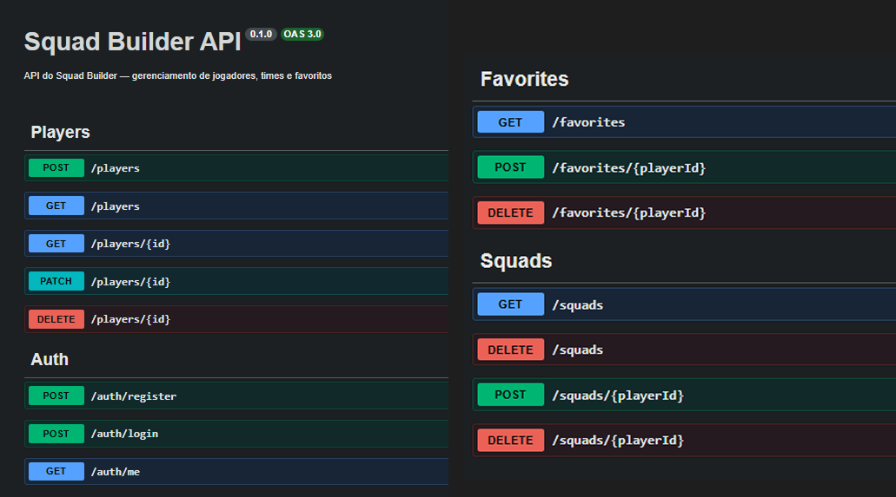
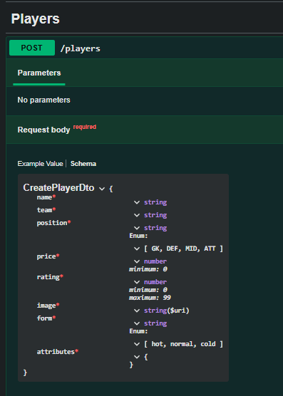
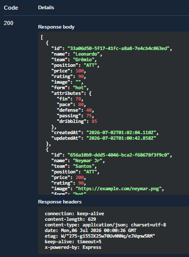

# Squad Builder — Backend

API REST do **Squad Builder**, um app de montar times de futebol. Este repositório é o backend
que serve os dados para o app mobile em React Native.


**API no ar:** https://squad-builder-api-ri3o.onrender.com
**Documentação (Swagger):** https://squad-builder-api-ri3o.onrender.com/docs

> A API roda no plano gratuito do Render, que hiberna após 15 minutos de inatividade.
> A primeira requisição depois de um tempo parado pode demorar cerca de um minuto.



## Sobre o projeto

O Squad Builder começou como um app mobile (React Native + Expo) onde os dados dos jogadores
eram mockados no próprio front. A ideia sempre foi ser fullstack, então este backend nasceu para
tirar os dados do dispositivo e centralizá-los em um servidor com banco de dados de verdade.

É um projeto de estudo, minha primeira imersão real em backend Node.js. O foco foi entender
cada peça, não só fazer funcionar: containers, ORM, migrations, injeção de dependência,
autenticação e arquitetura em camadas.

## Stack

- **[NestJS 11](https://nestjs.com/)**, framework Node.js com TypeScript
- **[Prisma 6](https://www.prisma.io/)**, ORM com schema declarativo, migrations e client tipado
- **[PostgreSQL 16](https://www.postgresql.org/)**, banco relacional (Docker em dev, [Neon](https://neon.com/) em produção)
- **[Passport + JWT](https://docs.nestjs.com/security/authentication)** e **bcrypt**, autenticação e hash de senha
- **[class-validator](https://github.com/typestack/class-validator)**, validação declarativa dos DTOs
- **[Swagger / OpenAPI](https://swagger.io/)**, documentação interativa gerada automaticamente
- **[Render](https://render.com/)**, hospedagem da API

## Funcionalidades

- **Catálogo de jogadores**: CRUD completo, com atributos flexíveis por posição (goleiro e
  jogador de linha têm atributos diferentes, resolvido com uma coluna `Json`).
- **Autenticação com JWT**: cadastro e login com senha hasheada via bcrypt, e rotas protegidas
  por guard.
- **Favoritos por usuário**: relação N:N entre usuário e jogador, com chave composta que impede
  duplicatas no próprio banco.
- **Times por usuário**, com as **regras de formação validadas no servidor**: máximo de 11
  jogadores e limite por posição (1 GK, 4 DEF, 3 MID, 3 ATT). O cliente também valida, mas para
  experiência; o servidor valida para garantir a regra.
- **Isolamento por usuário**: o cliente nunca envia de quem é o dado. O `userId` vem do token,
  então não há como ler ou alterar os dados de outra pessoa.
- **Documentação automática** em `/docs`, gerada a partir dos controllers e DTOs.

## Como rodar localmente

### Pré-requisitos

- [Node.js](https://nodejs.org/) 18+
- [Docker Desktop](https://www.docker.com/products/docker-desktop/) (para o Postgres)

### Passos

```bash
# 1. Instalar dependências
npm install

# 2. Criar o .env a partir do exemplo
cp .env.example .env

# 3. Subir o banco Postgres (Docker)
docker compose up -d

# 4. Aplicar as migrations e gerar o Prisma Client
npx prisma migrate dev

# 5. Popular o catálogo de jogadores
npx prisma db seed

# 6. Rodar em modo desenvolvimento (com hot reload)
npm run start:dev
```

A API sobe em `http://localhost:3000`.

- **Documentação (Swagger):** http://localhost:3000/docs
- **Prisma Studio** (painel visual do banco): `npx prisma studio` → http://localhost:5555

### Variáveis de ambiente

| Variável                                              | Descrição                                      |
| ----------------------------------------------------- | ---------------------------------------------- |
| `POSTGRES_USER` / `POSTGRES_PASSWORD` / `POSTGRES_DB` | Credenciais do container Postgres (dev)        |
| `DATABASE_URL`                                        | String de conexão usada pelo Prisma            |
| `JWT_SECRET`                                          | Chave usada para assinar e verificar os tokens |

Em produção essas variáveis ficam no painel do provedor, nunca no repositório.

## Endpoints

### Players

| Método | Rota           | Descrição                | Auth |
| ------ | -------------- | ------------------------ | ---- |
| GET    | `/players`     | Lista todos os jogadores | ‑    |
| GET    | `/players/:id` | Busca um jogador por id  | ‑    |
| POST   | `/players`     | Cria um jogador          | ‑    |
| PATCH  | `/players/:id` | Atualiza um jogador      | ‑    |
| DELETE | `/players/:id` | Remove um jogador        | ‑    |

### Auth

| Método | Rota             | Descrição                        | Auth |
| ------ | ---------------- | -------------------------------- | ---- |
| POST   | `/auth/register` | Cria uma conta e retorna o token | ‑    |
| POST   | `/auth/login`    | Autentica e retorna o token      | ‑    |
| GET    | `/auth/me`       | Retorna o usuário autenticado    | 🔒   |

### Favorites

| Método | Rota                   | Descrição                         | Auth |
| ------ | ---------------------- | --------------------------------- | ---- |
| GET    | `/favorites`           | Lista os favoritos do usuário     | 🔒   |
| POST   | `/favorites/:playerId` | Adiciona um jogador aos favoritos | 🔒   |
| DELETE | `/favorites/:playerId` | Remove dos favoritos              | 🔒   |

### Squads

| Método | Rota                | Descrição                               | Auth |
| ------ | ------------------- | --------------------------------------- | ---- |
| GET    | `/squads`           | Retorna o time do usuário               | 🔒   |
| POST   | `/squads/:playerId` | Adiciona um jogador (valida a formação) | 🔒   |
| DELETE | `/squads/:playerId` | Remove um jogador do time               | 🔒   |
| DELETE | `/squads`           | Limpa o time                            | 🔒   |

🔒 = exige o header `Authorization: Bearer <token>`

## Documentação da API

A documentação é gerada automaticamente a partir dos controllers e DTOs, sem escrita duplicada.
O schema do `CreatePlayerDto` (à esquerda) espelha exatamente as regras de validação definidas no
código, e o `Try it out` executa requisições reais contra o banco (à direita).

| Schema do DTO                                | Resposta real                                |
| -------------------------------------------- | -------------------------------------------- |
|  |  |

## Estrutura de pastas

```
squad-builder-backend/
├── prisma/
│   ├── schema.prisma        # models, enums e relações
│   ├── migrations/          # histórico versionado de mudanças do banco
│   └── seed.ts              # popula o catálogo de jogadores
├── src/
│   ├── main.ts              # bootstrap: ValidationPipe global + Swagger
│   ├── app.module.ts        # módulo raiz
│   ├── prisma/              # PrismaService + PrismaModule (global)
│   ├── players/             # catálogo de jogadores
│   ├── users/               # acesso a dados de usuário (sem controller)
│   ├── auth/                # register, login, JwtStrategy, guard e @CurrentUser
│   ├── favorites/           # favoritos por usuário
│   └── squads/              # times por usuário, com as regras de formação
├── docker-compose.yml       # Postgres 16 para desenvolvimento
└── .env.example             # modelo das variáveis de ambiente
```

## Modelagem

- `Player` e `User` são as entidades principais.
- `Favorite` e `SquadPlayer` são tabelas de junção entre usuário e jogador, ambas com chave
  primária composta (`userId` + `playerId`), o que impede duplicatas no nível do banco, e
  `onDelete: Cascade`, para não deixar registros órfãos.

## Deploy

- **Banco:** PostgreSQL gerenciado no [Neon](https://neon.com/) (região us-east-1).
- **API:** [Render](https://render.com/) (mesma região, para reduzir a latência entre a
  aplicação e o banco).
- As migrations são aplicadas a cada deploy com `prisma migrate deploy`.

## Roadmap

- [x] Setup do banco (Postgres + Docker)
- [x] Integração com Prisma (schema, migrations, PrismaService)
- [x] CRUD de players com validação de DTO
- [x] Documentação da API com Swagger
- [x] Autenticação com JWT (users, login, guards)
- [x] Favoritos por usuário
- [x] Squads por usuário (com regras de formação: 4-3-3, máx. 11, limites por posição)
- [x] Seed do banco
- [x] Conectar o app mobile à API
- [x] Deploy
- [ ] Testes automatizados
- [ ] Paginação e filtros no catálogo de jogadores
- [ ] Refresh token
